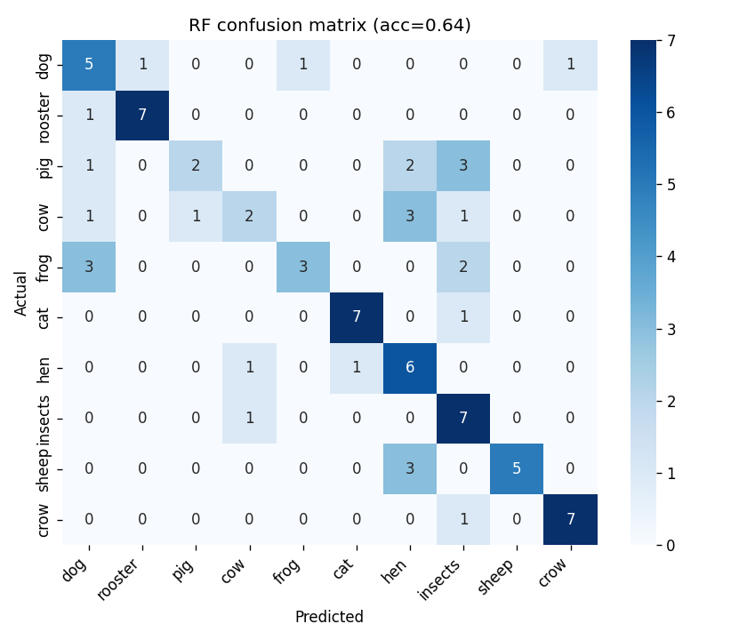
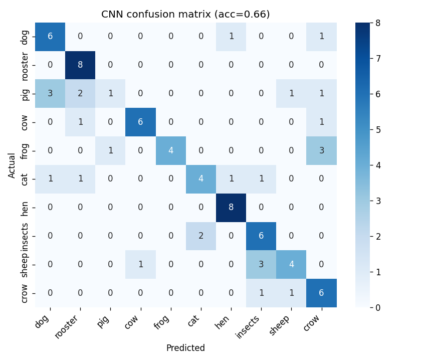

# Animal Sound Classifier

Classify 10 animal sounds (dog, cat, cow, frog, pig, hen, rooster, sheep, crow, insects) from a 5-second `.wav` clip. Compares a classical Random Forest baseline against a small CNN trained on log-mel spectrograms.

Built as a learning project and a portfolio piece. Inspired by [Moodify](https://github.com/cayetana-h/Moodify), but takes a different approach across every axis: real labels instead of clustered pseudo-labels, raw audio instead of pre-extracted Spotify features, and an honest two-model comparison instead of a single classifier.

## What this teaches

- How audio becomes a feature vector (MFCCs) or an image (mel-spectrogram).
- Why a classical baseline matters before reaching for deep learning.
- What a fair held-out evaluation looks like (ESC-50's pre-defined folds).
- Where the two model families actually differ — and where they don't.

## Results

| Model | Features | Test accuracy (fold 5) |
|---|---|---|
| Random Forest | 40-d MFCC summary (mean + std) | **63.8%** |
| Small CNN | 128-bin log-mel spectrogram | **66.3%** |

The headline: with only 320 training clips for 10 classes, the CNN barely edges out the Random Forest. That's the lesson — deep learning doesn't automatically win on small datasets, and a strong classical baseline keeps you honest. The gap would likely widen with data augmentation, a larger backbone, or pretraining; see "What I'd do next" below.

The off-diagonal is where the story is — hen/rooster and cow/sheep are the consistent mix-ups, which makes acoustic sense.

| Random Forest | CNN |
|---|---|
|  |  |

## Quickstart

```powershell
# 1. install
python -m venv .venv
.\.venv\Scripts\Activate.ps1
pip install -r requirements.txt

# 2. one-time data download (~600 MB)
python download_data.py

# 3. train both models (CPU works; CNN takes a few minutes)
python train.py

# 4a. predict from the command line
python predict.py data/animals/1-30226-A-0.wav

# 4b. or run the demo app
streamlit run app.py
```

## Repo layout

```
sound-classifier/
├── download_data.py    # pulls ESC-50, filters to animals
├── features.py         # MFCC summary + log-mel spectrogram
├── train.py            # trains RF + CNN, writes results.json + figures/
├── predict.py          # CLI inference
├── app.py              # Streamlit demo
├── notebook.py         # cell-marked exploration walkthrough
├── requirements.txt
└── README.md
```

## Approach notes

**Why ESC-50 animals.** Real human labels (no clustering tricks), balanced classes (40 clips per class), and built-in 5-fold cross-validation. Small enough to train on a laptop, well-known enough to compare against published benchmarks.

**Why both models.** A Random Forest on hand-crafted features is the cheapest thing that could possibly work — if a CNN can't beat it, you have a problem. The comparison itself is the lesson.

**Train/test split.** Folds 1–4 train, fold 5 tests. No clip ever appears in both. This is the standard ESC-50 protocol.

**Per-clip normalization for the CNN.** Each spectrogram is z-scored so the model can't cheat by reading recording loudness instead of acoustic content.

## What I'd do next

- Cross-dataset eval: pull a handful of animal clips from Freesound and measure the accuracy drop. That gap is the distribution-shift story.
- Data augmentation: time-shift, pitch-shift, and SpecAugment on the spectrograms — usually worth a few points for the CNN.
- A pretrained audio backbone (YAMNet or a small AST) — the obvious next step once the baseline is solid.

## Credits

- Dataset: [ESC-50](https://github.com/karolpiczak/ESC-50) by Karol J. Piczak (CC BY-NC).
- Conceptual inspiration: [Moodify](https://github.com/cayetana-h/Moodify) — this project shares the "ML on audio" theme but uses a different dataset, real labels, raw audio input, and a different model class.
